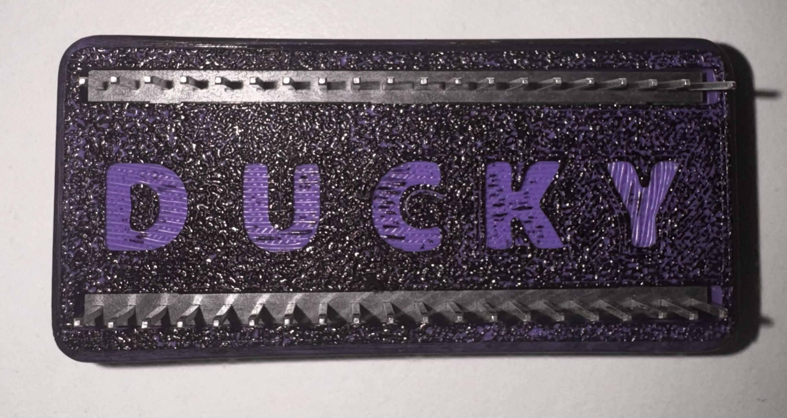
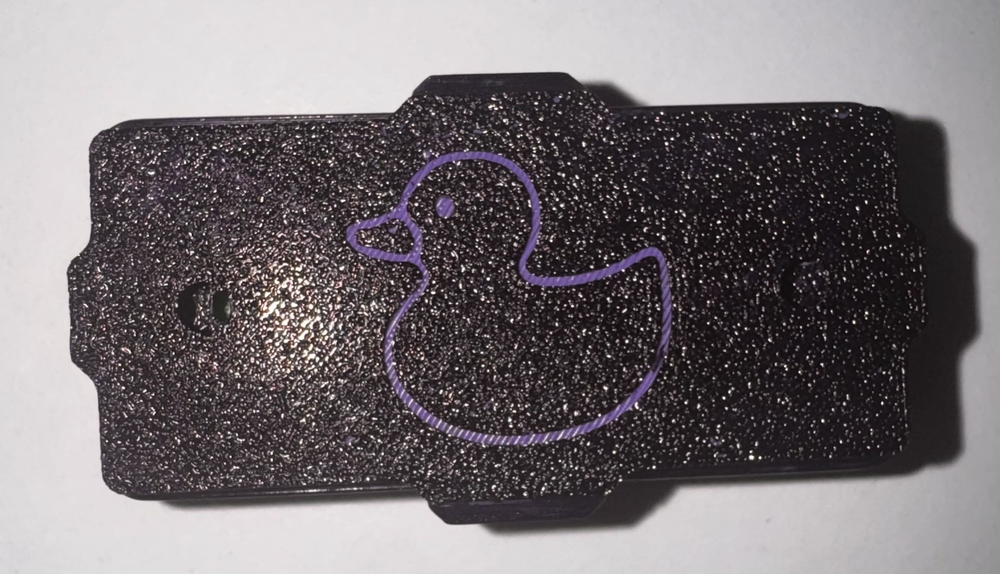
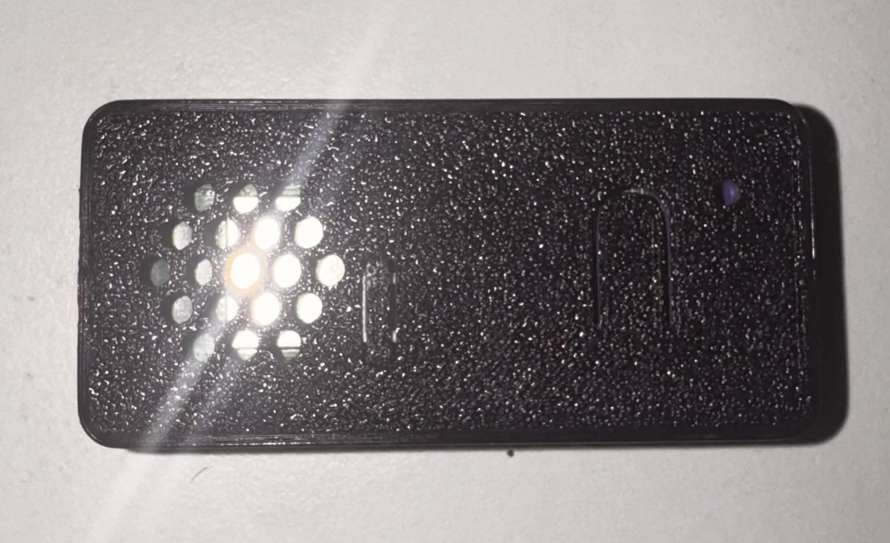

<h1 align="center">PicoWQuack — Setup & Quick Manual</h1>

PicoWQuack turns a Raspberry Pi Pico W into a tiny Wi‑Fi Rubber Ducky. Web UI runs on the device itself. Drop payloads on the board, call them from a browser, and the Pico types for you. Clean, brutal, reliable.

## What it does
Runs DuckyScript payloads from a browser. Hosts a tiny web UI on the Pico. Stores `.dd` payloads on the device. Supports core key combos and timing controls. I Personaly recommend controling it from your phone for fast easy access.

## Setup
1. Flash CircuitPython for the Pico W (get the UF2 from [CircuitPython — Raspberry Pi Pico W](https://circuitpython.org/board/raspberry_pi_pico_w/) and drop it on the board)._)
2. Copy ALL files from the "extract_to_pico" folder into the `CIRCUITPY` drive.
3. Edit `code.py` and set `HOTSPOT_SSID` and `HOTSPOT_PASSWORD`.
4. Plug the Pico into USB. It will connect to Wi‑Fi and print its IP to the REPL or into the active text field.

## physical setup mode
**This next part is taken from dbiso's repository. huge thanks.

Put a 2-pin jumper header on pin 1 (GP0) and pin 3 (GND) so you can toggle modes quickly. Jumper present = normal (Pico will inject). Jumper removed = setup/edit mode (Pico won’t inject).

## USB enable/disable mode

If you need the pico-ducky to not show up as a USB mass storage device for stealth, follow these instructions.  
- Enter setup mode.    
- Copy your payload script to the pico-ducky.  
- Disconnect the pico from your host PC.
- Connect a jumper wire between pin 18 (`GND`) and pin 20 (`GPIO15`).  
This will prevent the pico-ducky from showing up as a USB drive when plugged into the target computer.  
- Remove the jumper and reconnect to your PC to reprogram.  

Pico W: The default mode is USB mass storage **disabled**  

  

Open the IP in a browser. If it didn’t show an IP, check the REPL.

## Web UI
Two panes: the editor and the on‑device payload list.

The editor runs scripts you paste or upload. Controls: Run, Save (download), Upload (to editor), Clear.

The payload list shows `.dd` files in root. Actions: Refresh, Load (replace editor), Append, Run (execute file).

## DuckyScript supported
Supported commands: `REM`, `STRING <text>`, `DELAY <ms>`, `ENTER`, `GUI <key>`, `CTRL <key>`, `ALT <key>`, `SHIFT <key>`, F1–F12, arrows, `TAB`, `ESC`, `SPACE`, `DELETE`, `BACKSPACE`.

## !!Where to get scripts!!!
for a huge library of ready-made DuckyScript go to the hak5 repo
https://github.com/hak5/usbrubberducky-payloads
It contains dozens of cool scripts for you to try out. I recommend testing the [Hacker Typer](https://github.com/hak5/usbrubberducky-payloads/tree/master/payloads/library/prank/Hacker_Typer) payload. 

## Quick tips
If it doesn’t type, open the REPL; IP and errors print there. Store `.dd` files in root so the UI finds them. Test with harmless scripts first. Increase `DELAY` if keys drop. Avoid SSIDs or passwords containing emoji or unusual whitespace.

for educational purposes only

## 3D Printer Case
I also created a 3D model for a nice-looking Pico W case. The model files are included.

  
  
  

